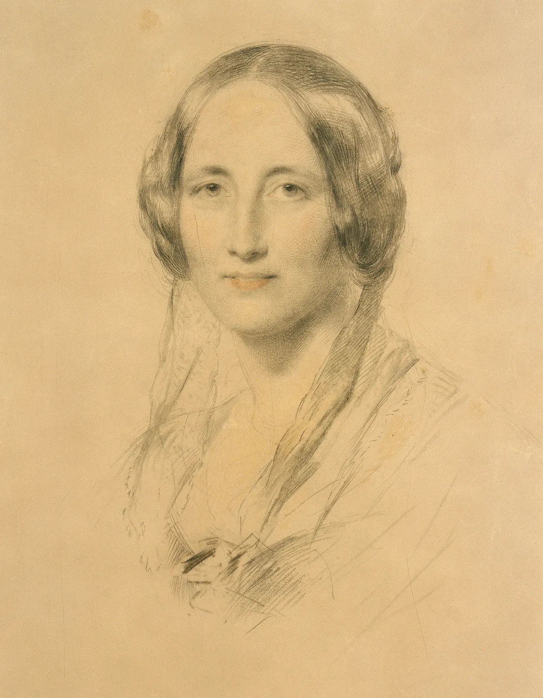

# Unfinished-Novel
Fine tuning Llama 2 to finish an unfinished novel in the style of the author.

Finishing an unfinished novel:
Learning objectives

Desciption:
 

Many well known writers have died with novels unfinished.  We came up with the idea to use a large language model to finish an unfinished novel in the style of the deceased writer.   We propose to use the author Elizabeth Gaskell:
https://en.wikipedia.org/wiki/Elizabeth_Gaskell
She was born in England in 1810 and wrote 7 full novels, 5 non-fiction works, and numerous novellas, short stories, and poems.   Her final novel "Wives and Daughters"  was published in serialized form.  She was a few chapters away from the end when she died of a stroke in 1865.  Fortunately, she had already planned the conclusion for the book.   Her editor completed it after her death. Her works are up on Project Gutenberg.   
Using her final novel offers the advantage of:
 - Lots of data of her "voice"
 - Small chunk of writing to generate
 - Something to compare it to.

